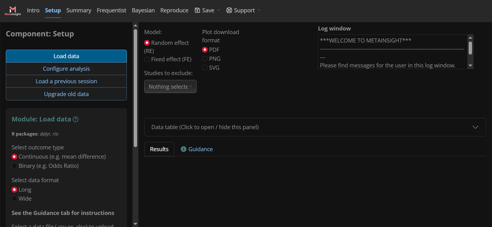

# Introduction

This document has been written to serve as a practical guide on how to develop new modules and components in a *{shinyscholar}* app. It covers the process of creating a new module in an existing component, or in a new component.

## Modules vs Components

{#fig-metainsight-setup}

### Components

A component is a set of operations and results which can be logically grouped together. The individual operations and results can be quite varied, but they come together to work towards a common purpose. In @fig-metainsight-setup we see the "Setup" component, which contains operations related to preparing data and options for analysis. The full list of components in this app contains:

- Intro
  - Gives the user an introduction to the app
- Setup
  - Prepare data and options for analysis
- Summary
  - Summarise the data
- Frequentist
  - Run and evaluate a frequentist meta-analysis of the data
- Bayesian
  - Run and evaluate a bayesian meta-analysis of the data
- Reproduce
  - Download a reproducible version of the analysis that has been run

### Modules

A module is an individual operation, and its outputs, within a component. This can be something simple such as selecting options, or it could be more involved, such as running an analysis and outputting some key findings. In @fig-metainsight-setup we see the modules in the "Setup" component:

- Load data
- Configure analysis
- Load a previous session
- Upgrade old data

Each module has a well-defined function, but they are used together to setup the data and analysis options. Modules may use inputs from other modules and components via a "common" object.

## Running the App After Making Changes

To run the app after making code changes, the following 3 commands should be run.

```
detach("package:metainsight", unload = TRUE)
devtools::install_local(path = getwd(), force = TRUE)
metainsight::run_metainsight()
```

# Creating a New Module

*{shinyscholar}* provides a helper function to create the skeleton of a new module. The following shows the typical parameters used in the function, where `<MODULE_IDENTIFIER>` is typically of the form `<COMPONENT_NAME>_<MODULE_NAME>` eg. `bayesian_forest` for the forest plot module in the bayesian analysis component.

```
shinyscholar::create_module(id = "<MODULE_IDENTIFIER>", dir = getwd(), result = TRUE, rmd = TRUE, save = TRUE)
```

This will create the required files, with the required structures, in the correct locations:

- In the `R` directory:
  - `<MODULE_IDENTIFIER>_f.R`
    - Contains one function named `<MODULE_IDENTIFIER>`
    - This is the function that creates the output
    - It is separated from the app functionality so that it can be used and tested independently
- In the `inst/shiny/modules` directory:
  - `<MODULE_IDENTIFIER>.md`
    - A markdown file to describe the functionality of the module, including any useful background for the user
  - `<MODULE_IDENTIFIER>.R`
    - An R file containing:
      - Function `<MODULE_IDENTIFIER>_module_ui`
        - Inputs for the module
      - Function `<MODULE_IDENTIFIER>_module_server`
        - Server function to run the module and populate the outputs
      - Function `<MODULE_IDENTIFIER>_module_result`
        - Outputs for the module
      - Function `<MODULE_IDENTIFIER>_module_rmd`
        - Create a list of parameters to use in the reproducible R-markdown file
  - `<MODULE_IDENTIFIER>.rmd`
    - An R-markdown file to recreate the outputs independently of the app
  - `<MODULE_IDENTIFIER>.yml`
    - A YAML file containing details of the module

Those files will not function in the skeleton state, but most of the "boilerplate" code will have been created. They will need to be populated with the required functionality and parameters for the module.

## `<MODULE_IDENTIFIER>_f.R`

Found in the `R` directory.

This contains all functions for creating the outputs for the module. This can be spread across multiple functions, and those functions do not all need to be tagged with `@export`, only those which are called by the module directly. If a module displays multiple plots, for example, there can be multiple exported functions.

## `<MODULE_IDENTIFIER>.md`

Found in the `inst/shiny/modules` directory.

Informs the user about the functionality of the module. Typically the title will be of the format `**module: <MODULE_NAME>**`, and it will contain sections:

- `**BACKGROUND**`
  - Describes the background of the module's functionality
- `**IMPLEMENTATION**`
  - Describes exactly what the module does, and how
- `**REFERENCES**`
  - Lists any references to external sources which are important to the rest of the description

## `<MODULE_IDENTIFIER>.R`

Found in the `inst/shiny/modules` directory.

Contains the code for running the module within the app.

### `<MODULE_IDENTIFIER>_module_ui()`

Creates the inputs for the module, which will be displayed in the left-hand side bar of the app. By default this includes only a "Run" button. Any parameters which will affect the outputs should be represented by an input here. If the module is supposed to run automatically, then the run button can be removed. This should not contain any outputs.

All inputs must be namespaced using `ns()`.

### `<MODULE_IDENTIFIER>_module_server()`

Contains the server code which will respond to the inputs and populate the outputs.

#### `observeEvent()` or `observe()`

By default an `observeEvent()` block will be created to run when the "Run" button is pressed. If the module is intended to run automatically, this should be changed to an `observe()` block. It has the following sections:

- `# WARNING ####`
  - Report any warnings using `common$logger |> shinyscholar::writeLog()`
- `# FUNCTION CALL ####`
  - Call the module function(s) to make any calculations. This should not generate anything graphical, such as plots
- `# LOAD INTO COMMON ####`
  - Load parameters and results into `common` using the format `common$parameter <- input$parameter`
- `# METADATA ####`
  - Save any metadata into `common` using the format `common$meta$<MODULE_IDENTIFIER>$parameter <- parameter`
  - Commonly this is only a parameter named "used" which will inform the R-markdown whether or not the module should be included in the reproducible output.
- `# TRIGGER ####`
  - Trigger any watchers using `gargoyle::trigger("<MODULE_IDENTIFIER>")`

#### Render Outputs

Add any `Render_()` calls to render to the outputs of the module, as would be done in a normal shiny app. The values should be taken from `common`, rather than directly from the inputs, and the render statement should begin with a call to `gargoyle::watch("<MODULE_IDENTIFIER>")`, and a call to `req()` for any objects which are required from other modules.

#### Return Statement

Provide functions to save and load input parameters and outputs that should be saved when the session is saved.

##### Save

The return from the save function should be of the format:

```
list(
  parameter_1 = input$parameter_1,
  parameter_2 = input$parameter_2
)
```

##### Load

The contents of the save function should be of the format:

```
update*(session, "parameter_1", value = state$parameter_1)
update*(session, "parameter_2", value = state$parameter_2)
```

### `<MODULE_IDENTIFIER>_module_result()`

Creates the outputs for the module, which will be displayed in the main panel of the app. By default this includes only a verbatim text output. This should not contain any inputs.

All outputs must be namespaced using `ns()`.

### `<MODULE_IDENTIFIER>_module_rmd()`

Store the parameters to be passed to the R-markdown file when creating the reproducible output. The values are taken from `common` and put into a list in the following format:

```
list(
  <MODULE_IDENTIFIER>_knit = !is.null(common$meta$<MODULE_IDENTIFIER>$used),
  <MODULE_IDENTIFIER>_parameter_1 = common$<MODULE_IDENTIFIER>_parameter_1,
  <MODULE_IDENTIFIER>_parameter_2 = common$<MODULE_IDENTIFIER>_parameter_2
)
```

This should always contain a parameter named `<MODULE_IDENTIFIER>_knit` which defines whether or not the module's output should be included in the reproducible output. This is usually whether or not the module has been run, which should be set in the metadata object within `common` when the module runs.

Note that even if a parameter is exported by another module, it still needs to be exported by every module that needs to use it in the R-markdown output. If a parameter is not exported by the module that will use it, then the parameter will not be accessible in the module's scope.

## `<MODULE_IDENTIFIER>.rmd`

Found in the `inst/shiny/modules` directory.

This file contains the reproducible R-markdown content for the module. It uses the parameters exported by the `<MODULE_IDENTIFIER>_module_rmd()` function in the `<MODULE_IDENTIFIER>.R` file. It is broken into 2 sections by default, but it can contain as many sections as is needed. The first section should contain a title and any preamble describing what the module does and any relevant details about the output. The second section contains the output, which should be the same as what is output in the UI by the module.

Variables from the module can be accessed by referencing them surrounded by 2 pairs of curly braces eg. `{{parameter}}`.

## `<MODULE_IDENTIFIER>.yml`

Found in the `inst/shiny/modules` directory.

This *YAML* file defines the basic information about the module:

- `component`
  - The name of the component in which this module is found
- `short_name`
  - Name of the module to be displayed in the menu for the component
- `long_name`
  - Name of the module to be displayed in the module
- `authors`
  - A list of the module authors' names
- `package`
  - A list of the names of the packages used by the module

## `test-<MODULE_IDENTIFIER>.R`

Found in the `tests/testthat` directory.

This file contains all of the unit tests for the function(s) in `R/<MODULE_IDENTIFIER>_f.R`, as well as any end-to-end tests of the module code found in `inst/shiny/modules/<MODULE_IDENTIFIER>.R`.

## Other Changes

There are a handful of other changes which must be made to existing files in order to add a new module to the app. Once these are made, the module should be complete and ready to run.

### `NAMESPACE`

A new `export()` line must be added for the function found(s) in `R/<MODULE_IDENTIFIER_f.R`. By convention these are added in alphabetical order.

### `inst/shiny/global.R`

In the vector named `base_module_configs`, the file path to the module's *YAML* file must be added. these are added in the order in which they will appear within the component.

### `inst/shiny/common.R`

The `common_class` object holds all of the objects which are stored within each module in the app. Any parameter which is to be stored in a module must be added to the list of public fields in this object, and should be cleared in the `reset()` function.

# Creating a New Component

A component cannot exist without modules within it, so everything in the previous section will need to be done for the new modules, as well as a few extra steps to create the component itself. Ensure that the newly created modules define the newly created component name in the *YAML* file.

## `inst/shiny/global.R`

The name of the module must be added to the `COMPONENTS` vector. These are added in the order that they will appear in the app.

## `inst/shiny/ui.R`

In the `page_navbar`, a new `nav_panel` must be added for the new component. These are added in the order that they will appear in the app.

In the `layout_sidebar`, a new call to `insert_modules_ui()` must be added, also in the order that the components will appear in the app.

# Example - New Component with 2 New Modules

This example contains a new "Maths" component, with 2 new modules: "Select" and "Plot". The "Select" module simply allows the user to select 2 numbers which are displayed and stored into `common`. The "Plot" module plots a 2 dimensional array of squares where the dimensions are the 2 numbers chosen in the "Select" module.

## "Select" Module

### `inst/shiny/modules/maths_select.R`

```{verbatim}
maths_select_module_ui <- function(id) {
  ns <- shiny::NS(id)
  div(
    h3("Select numbers"),
    numericInput(inputId = ns("number_1"), label = "First Number", value = 1, min = 1, max = 999999, step = 1),
    numericInput(inputId = ns("number_2"), label = "Second Number", value = 1, min = 1, max = 999999, step = 1),
    actionButton(ns("run"), "Select Numbers")
  )
}

maths_select_module_server <- function(id, common, parent_session) {
  moduleServer(id, function(input, output, session) {
    ns <- session$ns

    observeEvent(input$run, {
      # WARNING ####
      if (input$number_1 > 999999) {
        common$logger |>
          shinyscholar::writeLog(glue::glue("First number selected ({input$number_1}) is greater than 999999"))
      }
      if (input$number_2 > 999999) {
        common$logger |>
          shinyscholar::writeLog(glue::glue("Second number selected ({input$number_2}) is greater than 999999"))
      }
      
      # FUNCTION CALL ####

      # LOAD INTO COMMON ####
      common$maths_number_1 <- input$number_1
      common$maths_number_2 <- input$number_2

      # METADATA ####
      common$meta$maths_select$used <- TRUE

      # TRIGGER
      gargoyle::trigger("maths_select")

      show_results(parent_session)
    })
    
    output$number_text_1 <- renderText({
      gargoyle::watch("maths_select")
      glue::glue("First number: {common$maths_number_1}")
    })
    
    output$number_text_2 <- renderText({
      gargoyle::watch("maths_select")
      glue::glue("Second number: {common$maths_number_2}")
    })
    
    return(
      list(
        save = function() {
          list(
            ### Manual save start
            ### Manual save end
            number_1 = input$number_1,
            number_2 = input$number_2
          )
        },
        load = function(state) {
          ### Manual load start
          ### Manual load end
          updateNumericInput(session, "number_1", value = state$number_1)
          updateNumericInput(session, "number_2", value = state$number_2)
        }
      )
    )
  })
}

maths_select_module_result <- function(id) {
  ns <- NS(id)
  div(
    textOutput(outputId = ns("number_text_1")),
    textOutput(outputId = ns("number_text_2"))
  )
}

maths_select_module_rmd <- function(common){
  list(
    maths_select_knit = !is.null(common$meta$maths_select$used),
    maths_select_number_1 = common$maths_number_1,
    maths_select_number_2 = common$maths_number_2
  )
}
```

### `inst/shiny/modules/maths_select.Rmd`

````{verbatim}
```{asis, echo = {{maths_select_knit}}, eval = {{maths_select_knit}}, include = {{maths_select_knit}}}
### Select numbers
```

```{r, echo = {{maths_select_knit}}, include = {{maths_select_knit}}}
number_1 <- {{maths_select_number_1}}
number_2 <- {{maths_select_number_2}}

div(
  glue::glue("First number: {number_1}"),
  br(),
  glue::glue("Second number: {number_2}")
)
```
````

### `inst/shiny/modules/maths_select.yml`

```{verbatim}
component: "maths"
short_name: "Select numbers"
long_name: "Select numbers"
authors: "Janion Nevill"
package: []
```

### `inst/shiny/modules/maths_select.md`

```{verbatim}
### **Module:** ***Select Numbers***

**BACKGROUND**

Pick numbers for maths. It's not rocket surgery...
```

### `R/maths_select_f.R`

This module does not have a function associated with it, as it is only used to select numbers.

## "Plot" Module

### `inst/shiny/modules/maths_plot_matrix.R`

```{verbatim}
maths_plot_matrix_module_ui <- function(id) {
  ns <- shiny::NS(id)
  div(
    actionButton(ns("run"), "Generate Plot")
  )
}

maths_plot_matrix_module_server <- function(id, common, parent_session) {
  moduleServer(id, function(input, output, session) {
    ns <- session$ns
    
    observeEvent(input$run, {
      req(common$maths_number_1, common$maths_number_2)
      
      # WARNING ####
      if (common$maths_number_1 > 20 || common$maths_number_2 > 20) {
        common$logger |>
          shinyscholar::writeLog("Text may not be readable on plot")
      }
      
      # FUNCTION CALL ####

      # LOAD INTO COMMON ####

      # METADATA ####
      common$meta$maths_plot_matrix$used <- TRUE

      # TRIGGER
      gargoyle::trigger("maths_plot_matrix")

      show_results(parent_session)
    })
    
    output$plot <- renderPlot({
      gargoyle::watch("maths_plot_matrix")
      req(common$maths_number_1, common$maths_number_2)
      return(maths_plot_matrix(common$maths_number_1, common$maths_number_2))
    })
    
    return(
      list(
        save = function() {
          list(
            ### Manual save start
            ### Manual save end
          )
        },
        load = function(state) {
          ### Manual load start
          ### Manual load end
        }
      )
    )
  })
}

maths_plot_matrix_module_result <- function(id) {
  ns <- NS(id)
  plotOutput(outputId = ns("plot"))
}

maths_plot_matrix_module_rmd <- function(common){
  list(
    maths_plot_matrix_knit = !is.null(common$meta$maths_plot_matrix$used),
    maths_select_number_1 = common$maths_number_1,
    maths_select_number_2 = common$maths_number_2
  )
}
```

### `inst/shiny/modules/maths_plot_matrix.Rmd`

````{verbatim}
```{asis, echo = {{maths_plot_matrix_knit}}, eval = {{maths_plot_matrix_knit}}, include = {{maths_plot_matrix_knit}}}
### Plot an *n x m* matrix of squares
```

```{r, echo = {{maths_plot_matrix_knit}}, include = {{maths_plot_matrix_knit}}}
number_1 <- {{maths_select_number_1}}
number_2 <- {{maths_select_number_2}}

maths_plot_matrix(number_1, number_2)
```
````

### `inst/shiny/modules/maths_plot_matrix.yml`

```{verbatim}
component: "maths"
short_name: "Plot Matrix"
long_name: "Plot an n x m matrix of squares"
authors: "Janion Nevill"
package: [ggplot2]
```

### `inst/shiny/modules/maths_plot_matrix.md`

```{verbatim}
### **Module:** ***Plot a Matrix of Squares***

**BACKGROUND**

Plots an *n x m* matrix of squares.
```

### `R/maths_plot_matrix_f.R`

```{verbatim}
#' Create an n*m grid of numbered squares on a plot.
#'
#' @param number_1 Number of squares per row
#' @param number_2 Number of squares per column
#'
#' @return ggplot2 plot object
#' @export
maths_plot_matrix <- function(number_1, number_2) {
  size <- 4
  gap <- 1
  period <- size + gap
  
  data <- data.frame(
    xmin = period * rep(0:(number_1 - 1), number_2),
    ymin = unlist(
      lapply(
        0:(number_2 - 1),
        function(n) {
          return(period * rep(n, number_1))
        }
      )
    ),
    number = 1:(number_1 * number_2)
  )
  
  plot <- ggplot(data) +
    theme_void() +
    theme(
      legend.position = "none"
    ) +
    coord_fixed() +
    geom_rect(
      aes(
        xmin = xmin,
        ymin = ymin,
        xmax = xmin + size,
        ymax = ymin + size
      )
    ) +
    geom_text(
      aes(
        label = number,
        x = xmin + size / 2,
        y = ymin + size / 2,
        vjust = "center",
        hjust = "center",
        color = "red"
      ),
      size = 50 / max(number_1, number_2)
    )
  
  return(plot)
}
```

## Other File Changes

### `NAMESPACE`

In the namespace file, the logic function(s) must be exported.

```{verbatim}
export(maths_plot_matrix)
```

### `inst/shiny/common.R`

In the common class, the `maths_number_1` and `maths_number_2` objects to be stored are defined, and cleared in the `reset()` function. Unlike a list, this object will only accept assignments to defined fields.

```{verbatim}
common_class <- R6::R6Class(
  classname = "common",
  public = list(
    maths_number_1 = NULL,
    maths_number_2 = NULL,
    ...
    reset = function() {
      self$maths_number_1 = NULL
      self$maths_number_2 = NULL
      ...
```

### `inst/shiny/global.R`

In the global file, the "maths" component is defined in the components vector

```{verbatim}
COMPONENTS <- c("maths", "setup", "summary", "freq", "bayes", "rep")
```

and the "select" and "plot" modules are added to the base module configurations vector.

```{verbatim}
base_module_configs <- c(
  "modules/maths_select.yml",
  "modules/maths_plot_matrix.yml",
  ...
```

### `inst/shiny/ui.R`

In the UI, a tab is added to the navbar for the "maths" component

```{verbatim}
page_navbar(
  ...
  nav_panel("Maths", value = "maths"),
  ...
```

and the "maths" modules are added to the sidebar.

```{verbatim}
layout_sidebar(
  ...
  insert_modules_ui("maths", "Maths"),
  ...
```

# Pitfalls and Tips

## Outputs are rendering before the "run" button is clicked

Remember to use the object stored in `common$parameter` instead of the shiny `input$parameter`.

## The reproducible output fails to render

All parameters used in the output must be exported from the module that uses it, even if it were stored in another module.
