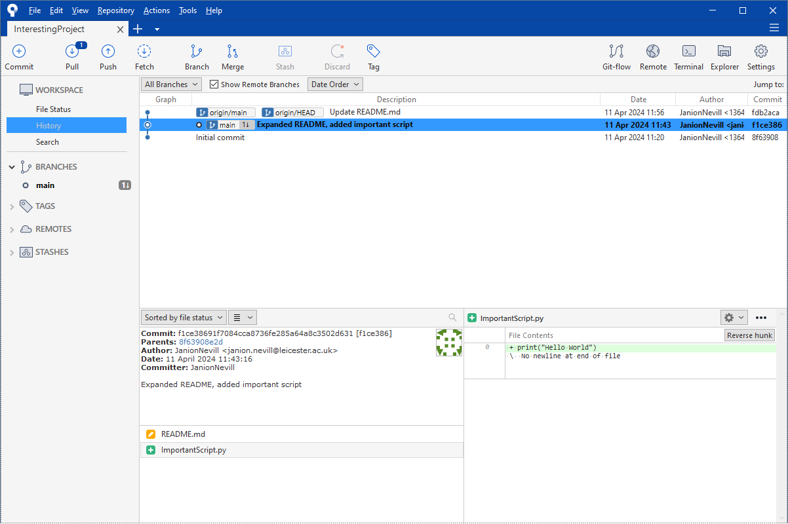
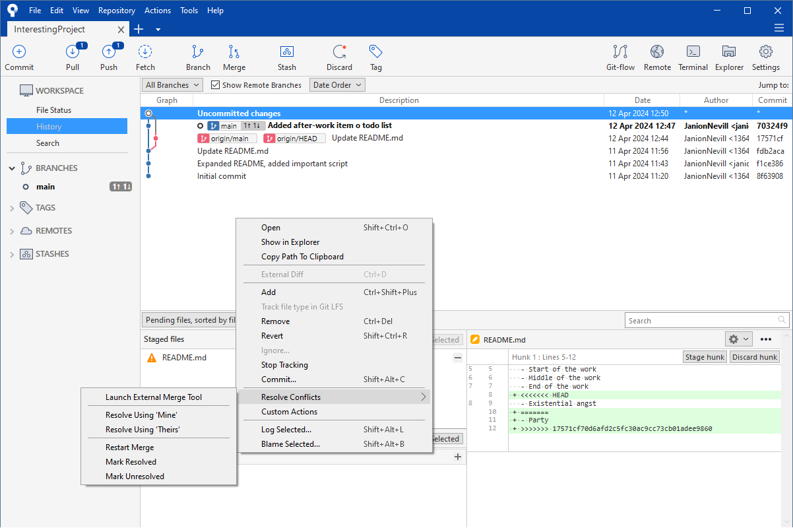

```{r, echo = FALSE, message = FALSE, include = FALSE}
# To get the glossary working correctly, the {glossary} package must be installed from GitHub
# remotes::install_github("https://github.com/debruine/glossary")
# This is because required features are not available in version 1.0.0, and no subsequent releases have been made

library(glossary)
glossary::glossary_path("gitGlossary.yml")
glossary::glossary_popup("hover")
```

<!---
# TODO:
- [X] Update alt-text for images
- [X] Move .gitignore section earlier
- [X] Add "Other Resources" section (with emails)
- [X] Add windows credentials section
- [X] Fix glossary
- [X] Make references to *Git*, *GitHub* and *Sourcetree* consistent.
- [X] Revert
- [X] Branches
- [X] Make section tags consistent
- [ ] Make references to buttons and sections consistent
--->

# Introduction

## What is 'Version Control'?

Have you ever found yourself naming files like the image below? If so, version control can help you.

```{r, label = "bad-vc", dpi=45, fig.align = "center", echo = FALSE, fig.cap ="How people commonly name their files..."}
knitr::include_graphics("images/BadVersionControl.png")
```

Version control is a system which records all changes made to documents stored in a `r glossary("repository")`. These documents are usually `r glossary("source code")` files but can be any format (e.g. word documents). This system makes a new entry in the `r glossary("history", display = "version history")` every time changes are `r glossary("commit", display = "committed")`; each record contains the list of changes made, a timestamp of when they were made and the name of the person who made them.

## Why Should I Bother with Version Control?

Having a record of previous versions allows anyone to look through old versions of their projects without needing to keep a local copy of every version they have made. This is especially useful when a new version is found to have new bugs since the last version. The individual changes can be examined to find the source of the problem without the need to look through the entire `r glossary("codebase")`. In particular with *`r glossary("GitHub")`*, when you go to view a commit, it will highlight the changes between versions for you. Furthermore, if needed, *`r glossary("Git")`* can allow you to revert back to a previous version (although how to do this is not covered in this document).

It also makes it easy to share code around if there is a public repository containing the code.

## What is *Git* and *GitHub*?

You may have previously heard about both *Git* and *GitHub*, but the difference between them is rarely explained. *Git* is an application that implements version control for any type of file, it is *Git* that actually does the work. *Git* can be used to track changes in a project on your local computer, without publishing it to the web, but this tutorial will focus on using *GitHub* as a remote repository.

*GitHub* is simply a web hosting service for projects; this is where projects can be stored, tracked, and published. A free account can create 3 private repositories which will be visible only to the user who created them and those who are explicitly given permission.

To put a metaphor on it, *GitHub* could be thought of as a warehouse which stores products (our files); *Git* would be the forklift used to move the products in and out of the warehouse.

## What is *Sourcetree*?

*Git* is often used as a command line tool, but this tutorial will use a graphical application to interact with it. *Sourcetree* simplifies the use of *Git* by allowing users to use a graphical interface, rather than needing to remember commands to be typed into the command line. This also makes it much easier to see changes and to perform more advanced operations.

Some applications have their own integration for *Git*, but many do not. *Sourcetree* is a stand-alone application which allows us to version control our files, while using whichever application we prefer to create and modify those files.

# Download and Install

This section demonstrates how to set up *Git* for a Windows computer, but the steps will be very similar for Macs.

## Download and Install *Git*

On university computers, *Git* must be installed via the software centre.

```{r, label = "software-git", dpi=96, fig.align = "center", echo = FALSE, fig.cap ="Installing Git using Software Centre"}
knitr::include_graphics("images/Software_Git.png")
```

## Download and Install *Sourcetree*

*Sourcetree* can be installed by downloading it from the [Sourcetree website](https://www.sourcetreeapp.com).

### Registration

If you have an existing *BitBucket* account, then this can be used to register the software, otherwise registration can be skipped.

```{r, label = "resgistration", dpi=96, fig.align = "center", echo = FALSE, fig.cap ="Registration step when installing Sourcetree"}

```

### Install Tools

For this tutorial, we are using *Git*, so *Mercurial* can be unchecked. *Mercurial* is another version control application similar to *Git*.

```{r, label = "install-tools", dpi=96, fig.align = "center", echo = FALSE, fig.cap ="Tool installation step when installing Sourcetree"}
knitr::include_graphics("images/sourcetree/sourcetree_install_tools.png")
```

### Preferences

Finally, *Sourcetree* requires a user name and email address. this is used to sign the commits in *Git*. It is recommended to use your full name without spaces, and your university email address.

```{r, label = "preferences", dpi=96, fig.align = "center", echo = FALSE, fig.cap ="Preferences step when installing Sourcetree"}

```

### Home Page

*Sourcetree* will open the home page with no repositories currently listed.

```{r, label = "home", dpi=96, fig.align = "center", echo = FALSE, fig.cap ="Sourcetree home page"}
knitr::include_graphics("images/sourcetree/sourcetree_fresh.png")
```

# Creating a *GitHub* Repository
This section will focus on starting a new project. If you have an existing repository that you would like to work on, then skip to \@ref(clone).

## Create a repository {#new-repo}
First, you need to create a new repository within your *GitHub* account. Go to <http://github.com> and create a new repository using the green *New* button in the top-left corner of the home page (figure \@ref(fig:new-repo-button)).

```{r, label = "new-repo-button", dpi=75, fig.align = "center", echo = FALSE, fig.cap ="Green new repository button on GitHub"}
knitr::include_graphics("images/github/github_home.png")
```

Next, fill in the necessary details as in figure \@ref(fig:create-new-repo). You can choose whether to have your repository as *public* or *private* depending on your needs; generally a public repository is preferable unless your code contains sensitive information or intellectual property which is to be protected.

Helpfully, *GitHub* provides templates for a `.gitignore` file, which will prevent you from committing files which are not required to share the project. Select the default for your project's language from the dropdown menu. This will be covered in more detail in \@ref(git-ignore)

```{r, label = "create-new-repo", dpi = 50, fig.align = "center", echo = FALSE, fig.cap = "New repository form on GitHub"}
knitr::include_graphics("images/github/github_new.png")
```

Once you have completed the configuration, click *Create repository*. You will be taken to the home of the project which will contain 2 files: `.gitignore` and `README.md`. This "README" file is a markdown file which is used to describe the project. By default, it will contain the name and description entered on the previous page.

```{r, label = "new-repo", dpi = 50, fig.align = "center", echo = FALSE, fig.cap = "Newly created repository on GitHub"}
knitr::include_graphics("images/github/github_project.png")
```

## Clone the Repository {#clone}
To make changes to the repository, it must first be `r glossary("clone", display = "cloned")` to the local machine. Copy the URL of the repository from your web browser, then click "Clone" in *Sourcetree*. On this page, you can paste in the repository URL, set a working directory to which to download the files, and enter a name for the project within *Sourcetree*.

```{r, label = "clone", dpi=110, fig.align = "center", echo = FALSE, fig.cap = "Clone options in Sourcetree"}
knitr::include_graphics("images/sourcetree/sourcetree_clone.png")
```

After clicking the *Clone* button, *Sourcetree* will open the project in the current tab.

```{r, label = "cloned", dpi=110, fig.align = "center", echo = FALSE, fig.cap = "Cloned repository in Sourcetree"}

```

# Preventing File Being Committed {#git-ignore}

When the remote repository was created, a file titled *.gitignore* was created. This file is what *Git* uses to know which files do not need version control. It is not necessary, but will mean that the *Sourcetree* won't get clogged up with files that don't need version control. This file can be edited in a text editor, like any other file. This may include files that automatically generated or managed by other software. A good example of this is editor configuration within the application used to write code. That is data related only to the local setup of the project, and is not needed for someone else to run the code on their own computer. You should also add files that contain sensitive information, such as datasets or keys.

Each line in this file names a file, folder or file type to be ignored when committing. All files of a given type can be excluded by using a `*` as a wildcard, eg. `*.xlsx` will ignore all excel spreadsheets.

# Committing and Pushing

In *Git* terminology, changes are "committed" to the local repository (on your own computer), then "pushed" to the remote repository (in this case on *GitHub*). By committing, the changes are saved into the version history, but remain only on the computer on which they were made. By pushing, the changes are uploaded to the *GitHub*.

## Commit Changes {#commit}

To test that the project has been successfully set up and linked with the *GitHub* repository, we are now going to commit changes and check that *GitHub* also receives it.

Open the `README.md` file in any text editor, and add some new text. Next, create a new file in the project directory. In this example a file named `ImportantScript.py` was created. These changes will be automatically detected by *Sourcetree* as shown in \@ref(fig:diff-files).

```{r, label = "diff-files", dpi = 50, fig.align = "center", echo = FALSE, fig.cap = "Sourcetree having detected changes"}
knitr::include_graphics("images/sourcetree/sourcetree_files.png")
```

Clicking on a changed file will show a diff (Short for "difference") in the right-hand panel, as in \@ref(fig:diff-change).

```{r, label = "diff-change", dpi = 50, fig.align = "center", echo = FALSE, fig.cap = "Sourcetree showing the 'diff' for an updated file"}

```

Before committing these changes, they must first be "staged". This means marking the files as ready to be committed. Files can be stage individually or all at once, using the *Stage All* button.

Once all the files are staged, a commit message should be added to the text box at the bottom of the page, then the *Commit* button can be clicked. Often the option to "Push changes automatically to origin/main" will be selected, but at this stage, the file is only committed.

```{r, label = "staged", dpi = 50, fig.align = "center", echo = FALSE, fig.cap = "Sourcetree showing the files staged"}
knitr::include_graphics("images/sourcetree/sourcetree_staged.png")
```

Once the changes have been committed, *Sourcetree* will display the "History" page, showing all commits to the project.

```{r, label = "committed", dpi = 50, fig.align = "center", echo = FALSE, fig.cap = "Sourcetree showing the commit history"}
knitr::include_graphics("images/sourcetree/sourcetree_committed.png")
```

Checking the project on *GitHub* will show that the changes have not yet been uploaded. This will be done in the next step, by "pushing" to the remote repository.

## Push Changes to *GitHub* {#push}

### Start Push

Note that in the top-left of the *Sourcetree* window, the *Push* button has a `1` badge on it. This is showing that there is 1 local commit which has not yet been pushed to the remote repository. Clicking that button will open a popup to configure that "push" \@ref(fig:push).

```{r, label = "push", dpi = 50, fig.align = "center", echo = FALSE, fig.cap = "'push' popup in Sourcetree"}

```

Click the *Push* button, and the commits will be pushed to *GitHub*.

### Provide Credentials

When you push for the first time, you will need to provide *GitHub* credentials to prove that you have permission to push to the remote repository. When you push subsequent times, the credentials should be stored, so you don't need to enter them again.

#### Windows Credentials Issue

On Windows computers, it is possible that the first push will fail due to the credentials being invalid, as in \@ref(fig:failed-push). This is due to Windows Credentials Manager using the wrong credentials to connect to *GitHub*.

```{r, label = "failed-push", dpi = 50, fig.align = "center", echo = FALSE, fig.cap = "Sourcetree showing the GitHub sign in popup"}

```

To fix this, the credentials should be cleared. Open the Windows Credentials Manager by searching for "credentials" in the task bar, then click "Manage Windows Credentials" to open the manager.

```{r, label = "windows-credentials-search", dpi = 50, fig.align = "center", echo = FALSE, fig.cap = "Search credentials manager in the windows task bar"}

```

The remove any credentials which mention "git", as shown in \@ref(fig:windows-credentials-remove).

```{r, label = "windows-credentials-remove", dpi = 50, fig.align = "center", echo = FALSE, fig.cap = "Remove credentials from Windows Credentials Manager"}

```

Once this has been done, retry the push.

### Provide GitHub Credentials

You will most likely be faced with a popup as seen in figure \@ref(fig:credentials) to link your *GitHub* account. Choose *Sign in with your browser* and then simply sign in (if you're already signed in on your web browser you may not need to do anything).

```{r, label = "credentials", dpi = 50, fig.align = "center", echo = FALSE, fig.cap = "Sourcetree showing the GitHub sign in popup"}
knitr::include_graphics("images/sourcetree/sourcetree_github_signin.png")
```

### Completed Push

After signing in, the push will complete and *Sourcetree* will return to the "History" tab.

```{r, label = "pushed", dpi = 50, fig.align = "center", echo = FALSE, fig.cap = "Sourcetree showing the history tab after pushing"}

```

Checking the repository on *GitHub* will now show that the changes have been received by *GitHub*. The page will need to be refreshed if it was left open from the original setup.

```{r, label = "pushed-github", dpi = 50, fig.align = "center", echo = FALSE, fig.cap = "GitHub showing changes after pushing"}
knitr::include_graphics("images/github/github_pushed.png")
```

## Reverting Changes

If changes have been made locally and are deemed to be unnecessary, then they can be 'reverted' back to the state of the most recent commit.

On the *commit* page in *Sourcetree*, right-click on the file to be reverted, and click "Revert". This will discard all changes to that file since the most recent commit.

```{r, label = "revert", dpi = 50, fig.align = "center", echo = FALSE, fig.cap = "Menu item to revert changes in Sourcetree"}
knitr::include_graphics("images/sourcetree/sourcetree_revert.png")
```

# Fetching and Pulling: Collaborating with Others

If all the changes come from a single computer, then committing and pushing are the only operations that are needed. However, more often than not, changes will be committed from multiple users on computers. In these cases, the local repository on each computer needs to be synchronised with the remote repository, downloading changes made by others, and merging them into the local changes.

This section will demonstrate how to keep a local repository in synch with the remote repository on *GitHub*.

## Commit Change via *GitHub* Directly {#remote-commit}

Instead of committing changes from another computer, changes can be committed directly on *GitHub*. Go to the home page of the repository and click the pencil button in the top-right of the README panel, as shown in \@ref(fig:github-edit).

```{r, label = "github-edit-button", dpi = 50, fig.align = "center", echo = FALSE, fig.cap = "Edit button for README.md on GitHub"}
knitr::include_graphics("images/github/github_edit_button.png")
```

Make some changes, then click the *Commit Changes* button.

```{r, label = "github-edit", dpi = 50, fig.align = "center", echo = FALSE, fig.cap = "Edit page onGitHub"}
knitr::include_graphics("images/github/github_edit.png")
```

Then click the *Commit Changes* button on the popup shown in \@ref(fig:github-commit).

```{r, label = "github-commit", dpi = 50, fig.align = "center", echo = FALSE, fig.cap = "Commit popup on GitHub"}

```

## Fetch Changes

When bringing in changes from the remote repository, "fetching" changes allows the incoming changes to be viewed without applying them to the local repository. It is not essential, but can be useful.

Back in *Sourcetree*, press the *Fetch* button to see the incoming changes from *GitHub*. Leave the default options on the popup, and click *OK*.

```{r, label = "fetch", dpi = 50, fig.align = "center", echo = FALSE, fig.cap = "Fetch popup in Sourcetree"}

```

*Sourcetree* will show the *History* tab, selecting and emboldening the commit on which the local changes are based, as in \@ref(fig:fetched).

```{r, label = "fetched", dpi = 50, fig.align = "center", echo = FALSE, fig.cap = "Changes fetched, but not integrated into the local repository, shown by the latest changes being higher that the current repository version in the history panel"}

```

## Pull Changes {#pull}

If the changes are to be merged into the local repository, then they can be "pulled". Click the *Pull* button. Again, the default options can be left as they are as in \@ref(fig:pull).

```{r, label = "pull", dpi = 50, fig.align = "center", echo = FALSE, fig.cap = "Pull popup in Sourcetree"}

```

Click *Pull* to bring in the changes. *Sourcetree* will show the updated history page, and the local files will now include the changes made on *GitHub*.

```{r, label = "pulled", dpi = 50, fig.align = "center", echo = FALSE, fig.cap = "Sourcetree showing the history tab after pulling"}

```

# Merging Conflicts

In this section, changes will be made to both the local and remote repositories, and the resulting conflict will be resolved.

## Make Changes Locally and on *GitHub*

Similarly to \@ref(commit), open the `README.md` file in any text editor, and add a new line. Similarly to \@ref(remote-commit), add a different new line to `README.md` and commit it directly on *GitHub*.

## Pull Changes from *GitHub*

### Uncommitted Changes

Pulling changes to a file which has uncommitted local changes will result in an error, as shown in \@ref(fig:uncommitted-pull). The changes must be committed before the pull can be completed.

```{r, label = "uncommitted-pull", dpi = 50, fig.align = "center", echo = FALSE, fig.cap = "Sourcetree showing a failed pull due to uncommitted local changes conflicting with the remote changes"}
knitr::include_graphics("images/sourcetree/sourcetree_uncommitted_conflict.png")
```

### Committed Conflicting Changes

The local changes can either be committed or reverted. In this example, the changes will be committed similarly to \@ref(commit).

## Merge Changes

### Pull

Clicking the *Pull* button again will show that there are conflicts to be resolved. Click *Close*, and open the conflicting file in your preferred editor. The conflicting sections will be formatted as shown in \@ref(fig:resolve-conflict).

```{r, label = "resolve-conflict", dpi = 50, fig.align = "center", echo = FALSE, fig.cap = "Sourcetree showing conflicts in the bottom-right panel"}

```

### Resolve Conflicts

If the changes are to be fully overwritten by either the remote or the local file, then the right-click menu, shown in \@ref(fig:resolve-conflicts-menu), can be used to *Resolve Using 'Mine'* to overwrite with local changes, or *Resolve Using 'Theirs' to overwrite with remote changes.

If the conflicts are more complex, then the conflicting file can be manually merged, then the right-click menu can be used to *Mark Resolved*, which will automatically stage the changes.

```{r, label = "resolve-conflicts-menu", dpi = 50, fig.align = "center", echo = FALSE, fig.cap = "Menu item to manually resolve conflicts in Sourcetree"}

```

### Stage, Commit and Push

Once the conflicts have been resolved, then they can be committed and pushed as normal. A commit comment will be automatically generated for this merge commit, as shown in \@ref(fig:resolved-conflict-commit).

```{r, label = "resolved-conflict-commit", dpi = 50, fig.align = "center", echo = FALSE, fig.cap = "Sourcetree showing the history tab after pushing"}

```

The *History* page will be shown again with the changes merged in, as if \@ref(fig:resolved-conflict-pushed).

```{r, label = "resolved-conflict-pushed", dpi = 50, fig.align = "center", echo = FALSE, fig.cap = "Sourcetree with automatically generated commit message for merge"}
knitr::include_graphics("images/sourcetree/sourcetree_resolved_conflict_pushed.png")
```

# Branches

Whilst often not necessary when working individually on a project, "`r glossary("branch", display = "branches")`" are a useful feature of *Git*, allowing the user to make changes whilst keeping a safe copy of the original code still available. It is also useful when multiple people are working on different features in the same codebase - each user can be working on a separate branch, avoiding conflicts until the changes are merged back into the main branch.

## Create a Branch

Branches can be created on the remote repository directly using *GitHub*, or on the local repository using *Sourcetree*, then pushed to *GitHub*. Both of these approaches are described here. Either method is acceptable, so feel free to use whichever workflow is preferred.

### Using *GitHub*

#### Create Branch

Go to the project home and click on the branches button, titled "1 branch", in the top-left.

```{r, label = "github-branch", dpi = 50, fig.align = "center", echo = FALSE, fig.cap = "Branches button on GitHub"}

```

*GitHub* will display all of the current branches in the repository; currently there is only one branch, "main".

```{r, label = "github-branches", dpi = 50, fig.align = "center", echo = FALSE, fig.cap = "Branches page on GitHub"}

```

Click the "New Branch" button, in the top-right, and enter a branch name. Branches must have unique names to identify them. *GitHub* allows for branches to be created from any other branch, but in this case there is only "main". Click "Create new branch".

```{r, label = "github-new-branch", dpi = 50, fig.align = "center", echo = FALSE, fig.cap = "Create branch popup on GitHub"}
knitr::include_graphics("images/github/github_new_branch.png")
```

*GitHub* will return to the branches page, but the new branch is now present. This can now be checked out in *Sourcetree*.

```{r, label = "github-new-branches", dpi = 50, fig.align = "center", echo = FALSE, fig.cap = "Branches page on GitHub after new branch has been created"}

```

#### Checkout branch {#checkout}

To access this branch in *Sourcetree*, it must be checked out. In order for *Sourcetree* to detect the newly created remote branch, changes must first be pulled. Once that has completed, find the branch by expanding the "Remotes" section in the left-hand panel, and select it. Right click on the selected branch and click "Checkout origin/<BRANCH NAME>".

```{r, label = "checkout-branch", dpi = 50, fig.align = "center", echo = FALSE, fig.cap = "Menu item to checkout a remote branch within Sourcetree"}
knitr::include_graphics("images/sourcetree/sourcetree_checkout_branch.png")
```

Leave the default options in the popup, and click "OK". Once it has finished processing, the working copy is now on the branch.

```{r, label = "checkout-new-branch", dpi = 50, fig.align = "center", echo = FALSE, fig.cap = "Remote branch checkout popup in Sourcetree"}

```

### Using *Sourcetree*

Before a branch is to be created, the base for the new branch must be checked out. This is described in \@ref(checkout). A branch on the local repository can also be used as a base, by checking out the local branch within the "Branches" section in the left-hand panel.

In *Sourcetree*, click the "Branch" button in the top bar, and enter the name of the new branch. Click "Create Branch", and it will be created and checked out.

```{r, label = "sourcetree-create-branch", dpi = 50, fig.align = "center", echo = FALSE, fig.cap = "New branch popup in Sourcetree"}
knitr::include_graphics("images/sourcetree/sourcetree_create_branch.png")
```

To add the new branch to the remote repository on *GitHub*, changes must be pushed. Click the "Push" button in the top bar, then select only the new branch to be pushed. Click "Push" to add the new branch to the remote repository.

```{r, label = "push-branch", dpi = 50, fig.align = "center", echo = FALSE, fig.cap = "Push popup in Sourcetree"}

```

## Merging branches

After changes are completed on a branch, they should be merged back to the main branch. The simplest way to do this is via *GitHub*, but it can also be done via *Sourcetree*. If a project does not have a remote repository, then merging can only be done via *Sourcetree*.

First, make a change, commit it to the new branch and push the commit. In this case, "aims" have been added to the README file.

```{r, label = "add-aims", dpi = 50, fig.align = "center", echo = FALSE, fig.cap = "Sourcetree showing local changes in commit page"}
knitr::include_graphics("images/sourcetree/sourcetree_add_aims.png")
```

### Merging in *GitHub*

#### Create Pull Request

Go to the repository in *GitHub*, and select the branch in the drop-down box in the top-left. You may see that the branch is ahead of the main branch, or that changes were recently pushed to the branch. To merge the branches, click on the green 'Compare and pull request' button.

```{r, label = "recent-push", dpi = 50, fig.align = "center", echo = FALSE, fig.cap = "GitHub showing recent changes to branch"}
knitr::include_graphics("images/github/github_recent_push.png")
```

If the branch is older and hasn't had recent pushes, then a new pull request can be opened by clicking on "Pull requests" at the top of the page.

```{r, label = "pull-requests", dpi = 50, fig.align = "center", echo = FALSE, fig.cap = "Pull requests page on GitHub"}
knitr::include_graphics("images/github/github_pull_requests.png")
```

Click "New pull request" to open the configuration page, then select the branch to merge into main.

```{r, label = "new-pull-request", dpi = 50, fig.align = "center", echo = FALSE, fig.cap = "Comparing changes page on GitHub"}
knitr::include_graphics("images/github/github_selected_pull_request.png")
```

Add a title and a description, then click "Create pull request".

```{r, label = "create-pull-request", dpi = 50, fig.align = "center", echo = FALSE, fig.cap = "Create pull request page on GitHub"}

```

#### Merge Pull Request

Within the created pull request, the changes can be reviewed. When happy with the changes, click "Merge pull request". If changes cannot be automatically merged, then *GitHub* will ask you to resolve conflicts before merging.

```{r, label = "created-pull-request", dpi = 50, fig.align = "center", echo = FALSE, fig.cap = "Created pull request page on GitHub"}

```

The default commit message can be left unchanged unless required, then click "Confirm merge".

```{r, label = "confirm-merge", dpi = 50, fig.align = "center", echo = FALSE, fig.cap = "Merge options on GitHub"}
knitr::include_graphics("images/github/github_confirm_merge.png")
```

Click "Delete branch" to delete the branch from the remote repository.

```{r, label = "delete-remote-branch-github", dpi = 50, fig.align = "center", echo = FALSE, fig.cap = "Merge confirmation on GitHub"}
knitr::include_graphics("images/github/github_delete_branch.png")
```

Returning to the home page of the project will show that the changes are now present on main and that there is only one branch on the project.

```{r, label = "github-merged", dpi = 50, fig.align = "center", echo = FALSE, fig.cap = "Repository home page on GitHub showing one branch and including changes from merged branch"}

```

#### Checkout Main Branch in *Sourcetree* {#post-merge-checkout}

Back in *Sourcetree*, the main branch needs to be checked out, as the local branch no longer points to a remote branch. Select the "main" branch in the "Branches" section in the left-hand panel, then right-click and click "Checkout main...".

```{r, label = "post-merge-checkout", dpi = 50, fig.align = "center", echo = FALSE, fig.cap = "Menu item to checkout the main branch in Sourcetree"}

```

Once the checkout has completed, pull from the remote repository to get the merged changes.

### Merging in *Sourcetree*

#### Merge Changes

In *Sourcetree*, checkout the main branch, as in \@ref(post-merge-checkout), then click "Merge" in the top bar. Select the most recent commit from the branch, then click "OK". The merge will be completed and the local main branch will include the changes from the branch.

```{r, label = "select-merge-commit", dpi = 50, fig.align = "center", echo = FALSE, fig.cap = "Merge popup in Sourcetree"}
knitr::include_graphics("images/sourcetree/sourcetree_select_merge_commit.png")
```

The main branch should then be pushed to the remote repository.

#### Delete Branches

The branch can now be deleted both locally and remotely. The local repository can be deleted in the same right-click menu used to checkout a local branch.

```{r, label = "delete-local-branch", dpi = 50, fig.align = "center", echo = FALSE, fig.cap = "Menu item to delete a local branch in sourcetree"}

```

The remote repository can be deleted in the same right-click menu used to checkout a remote branch.

```{r, label = "delete-remote-branch", dpi = 50, fig.align = "center", echo = FALSE, fig.cap = "Menu item to delete a remote branch in sourcetree"}
knitr::include_graphics("images/sourcetree/sourcetree_delete_remote_branch.png")
```

# Other Resources
- [Happy Git and GitHub for the useR](https://happygitwithr.com/)
  - Getting started with Git and GitHub specifically for *R* users.

If you find yourself stuck with any of the topics covered in this document, please feel free to contact us at clareece.nevill@leicester.ac.uk or janion.nevill@leicester.ac.uk.

# Glossary
```{r, echo = FALSE, message = FALSE}
glossary::glossary_load_all("gitGlossary.yml")
glossary::glossary_table()
```
